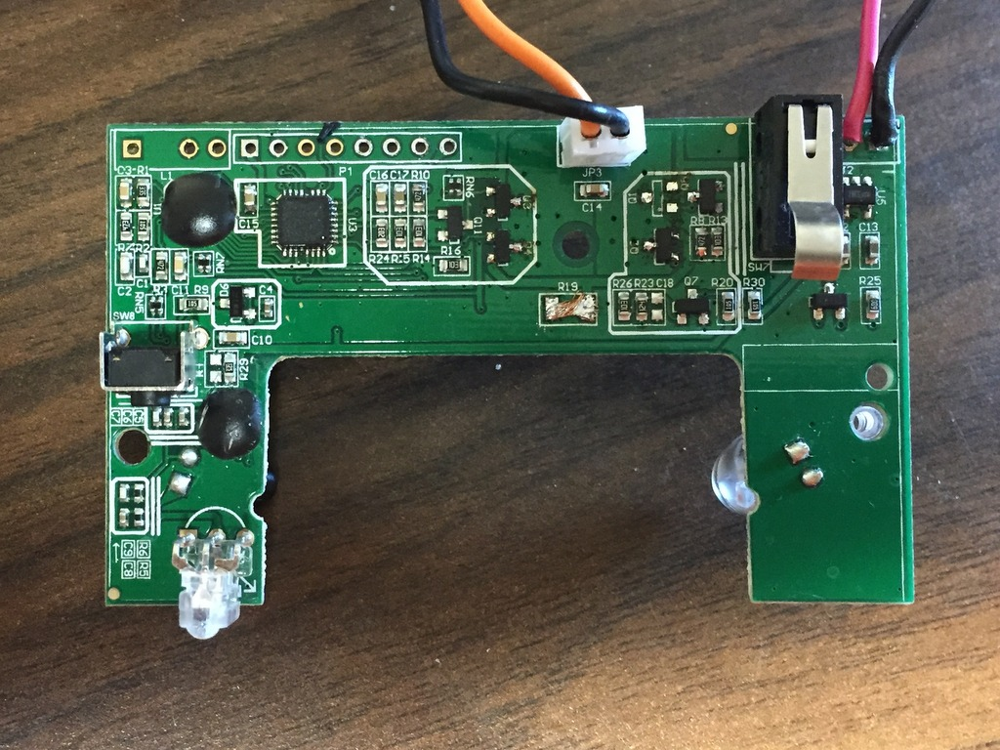
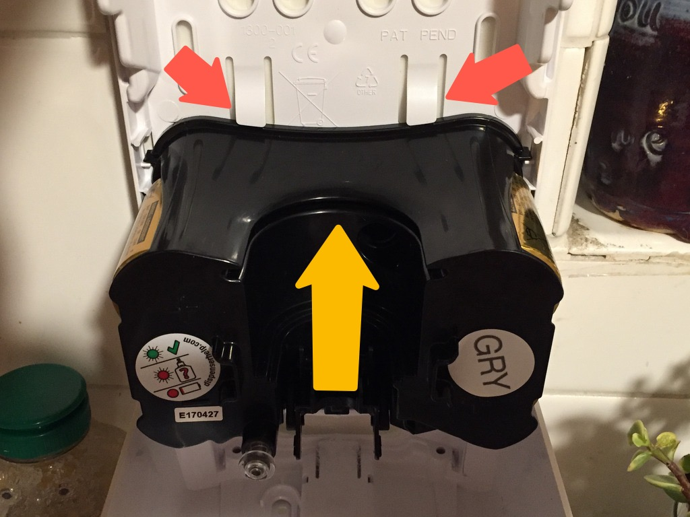
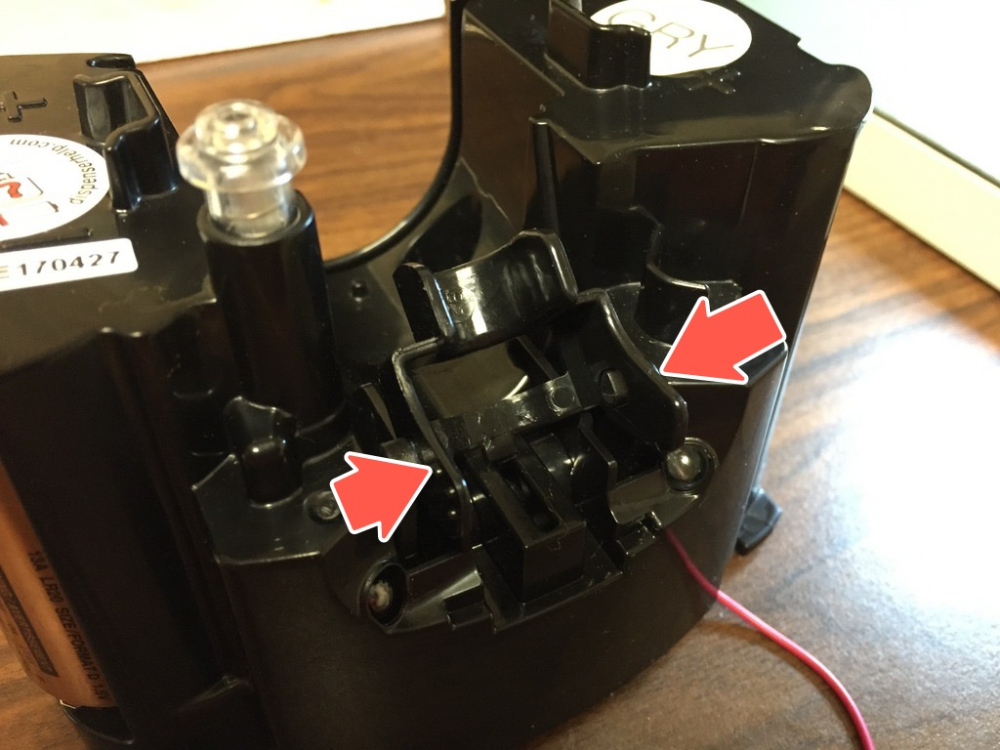
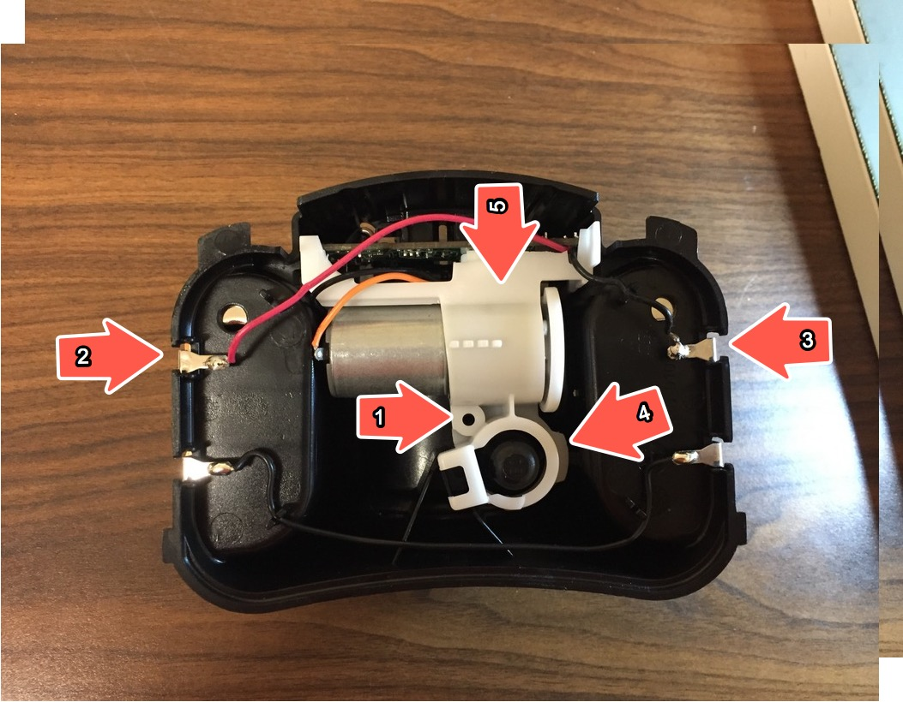
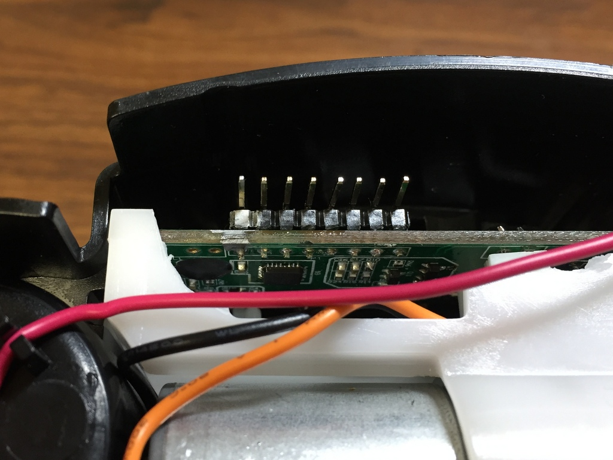

Running Arduino firmware on a GOJO LTX-7 Soap Dispenser 
============

This project documents how I modified our GOJO LTX-7 soap dispenser by reflashing it
 with an Arduino firmware. 

Apparently the GOJO LTX-7 and possibly similar models are Arduino ready. They are powered by 
AVR Tiny48 (256B RAM, 4K FLASH) and have row of PCB pads that provide access to the 
ISP signals for programming.

IMPORTANT: once you reflash your soap dispenser you cannot restore the original firmware. 
If you want to be able to restore the original firmware, replace the ATTiny48 
on the board with a digikey ATTINY48-MURCT-ND IC and install the stock IC 
back to restore the original functionality.

To reflash the soap dispenser I soldered a row of header pins that connects via an 
adapter board to an Arduino supported programmer (the one I used in Atmel MKII).  
The arduino sketch I programmed is minimal but sufficient for our needs. It doesn't 
performed some of the advanced functions of the stock firmware such as current and 
voltage sensing, RFID, etc and just performs a basic functionality of activating the 
pump motor each trigger it gets from the IR proximity sensors.  To do that it needs to 
sense the motor position switch to stop the motor when reaching that 'parking' angle 
and it controls the motor via 4 power mosfets in H configuration. The sketch uses 
only 3 of the H bridge modes (motor off, forward, forced brake) and doesn't use the 
reverse mode. The number of pump strokes (each a single motor revolution) is software 
programmable, the stock devices are programmed for a single stroke, we prefer two 
strokes per activation for extra soap. The Arduino sketch also puts the MCU to 
sleep between activations to reduce the power consumption.

The Arduino sketch uses the ATTiny48 Core by Spence Konda https://github.com/SpenceKonde/ATTinyCore 
which also sells AVR Tiny boards on Tindie in case you want to do some independent 
ATTiny development (the boards are not required to run Arduino sketches on the GOJO soap dispenser). 
You will need to install the ATTIny48 Core in your Arduino IDE to be able to compile the 
Arduino sketch. The IDE setting uses is documented at the top of the Arduino sketch.

Content of this repository
* Partial Kicad schematic of the board. It's sufficient to understand how to interface 
with the sensors and control the motor. https://github.com/zapta/misc/tree/master/soap_dispenser/board
* Arduino sketch with simple but useful soap dispensing logic.  
https://github.com/zapta/misc/tree/master/soap_dispenser/arduino
* Kicad schematic and gerbers for a  an ISP adapter board. This is not 
really necessary and it's faster to just hack one from a small prototyping PCB. 
https://github.com/zapta/misc/tree/master/soap_dispenser/adapter

The soap dispencer electronic board. The ICSP programming signals are at the 8 pad row at the top of the board.

 

To remove the mechanism (the black unit in the picture), press down the two tabs above 
it, push the mechanism up a little bit to release it and then pull it toward you.

 

To access the electronic board you first need to release the motor fork that activate the 
pump. Press in at the two points marked with an arror and seperate the motore fork 
from the carriage that moves up and down.

 

Then, remove the screw (1), desolder the red (2) and black (3) wires from the battery tabs, 
press and release the tab (4) and pull up the motor and the white assmebly (5). the 
unit with the motor and electronic board will come out.

 

To program the unit from the Arduino IDE you need to connect the programmer signals 
to the raw of 8 pads at the top (only 6 pins are used). Check the schematic here for 
exact pads to use. I chose to solder a 90 degrees 8 pin header which provide easy 
access to the programing pad and has enough clearance when reassmebling the soap
dispenser for eazy future modfications.

